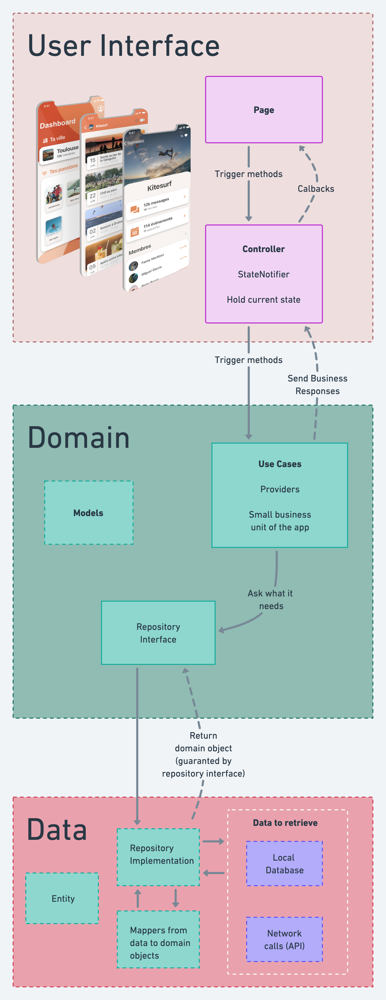
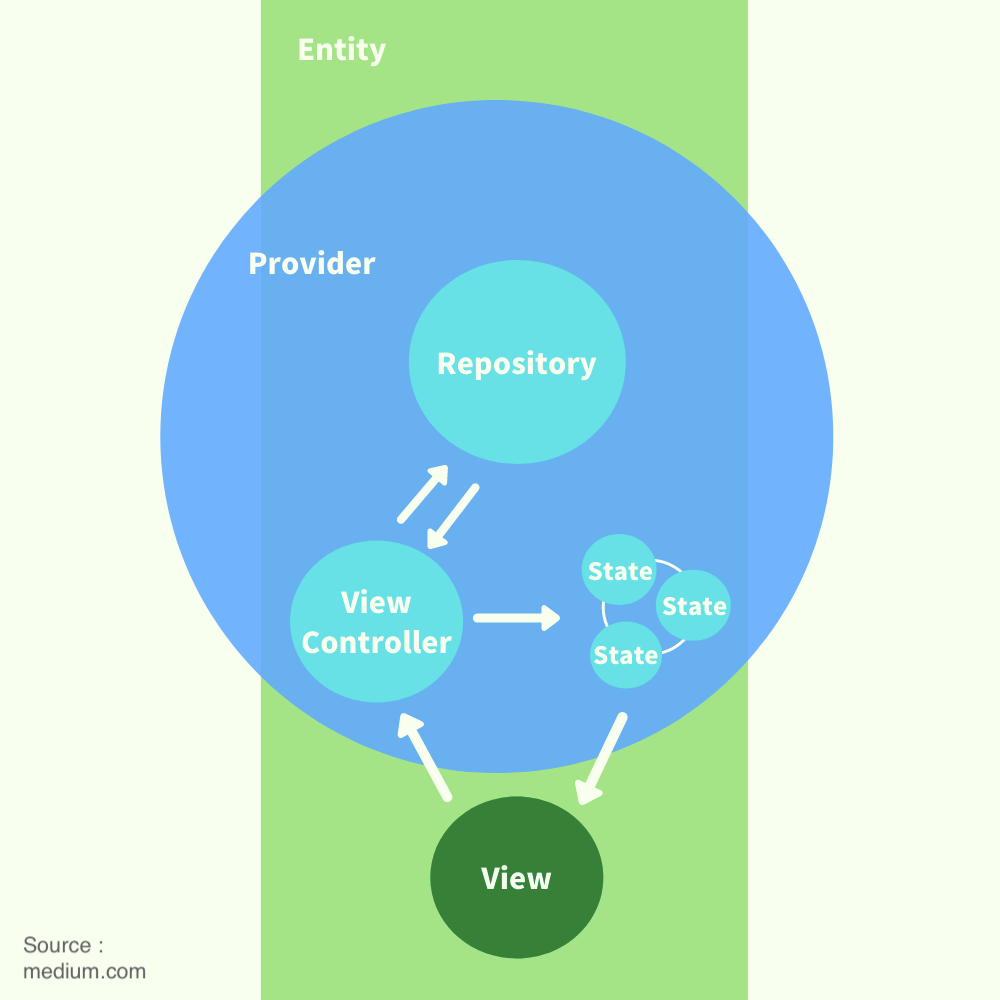
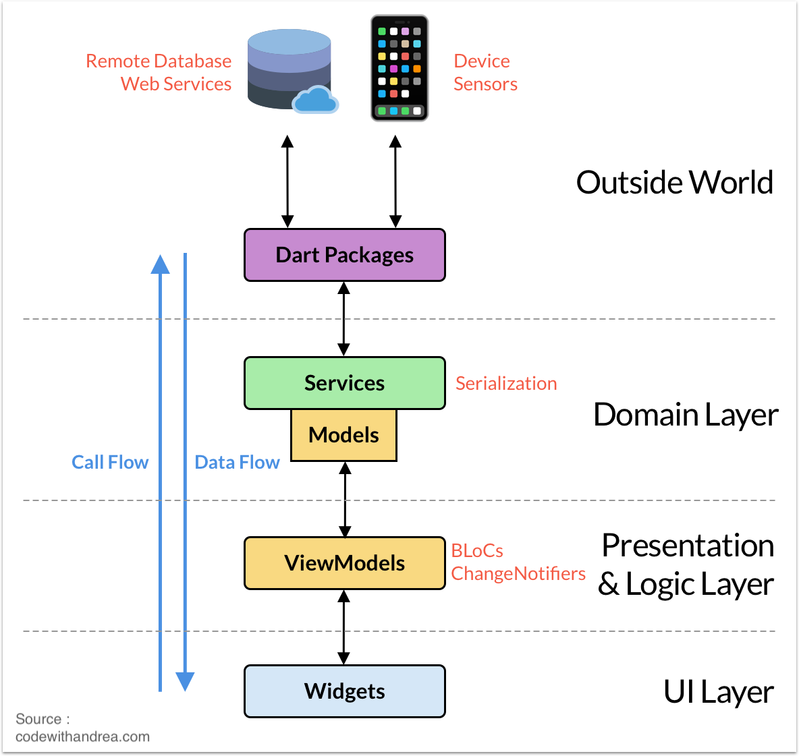
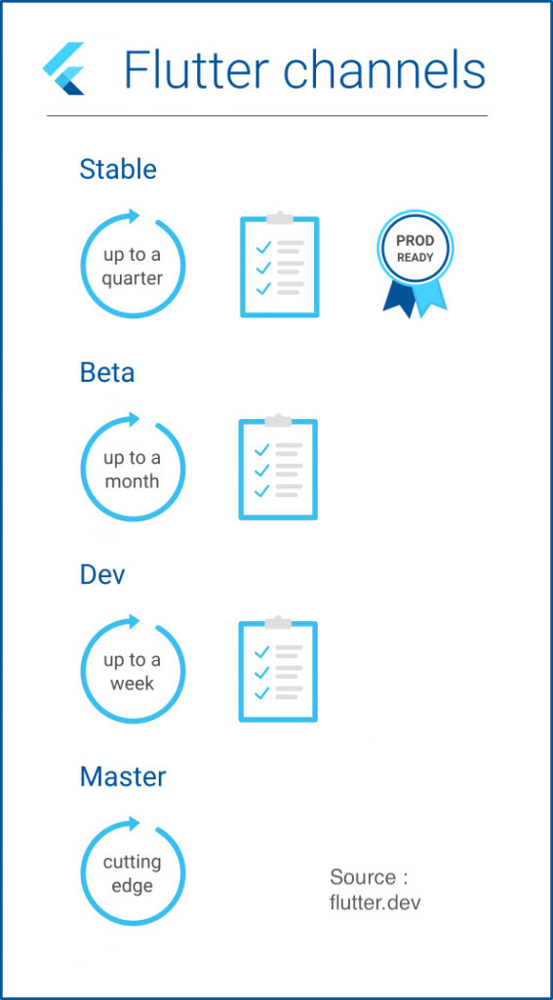

# Here Comes The Sun

Here Comes The Sun is a mobile application to provide the weather during the tour of The Beatles !
This projects demonstrates how to use the library Riverpod.

## Prerequisites
Here Comes The Sun runs on following devices :
- Android >= API 19
- iOS >= iOS 10.12

# Getting started
## Running the project

### Run from Terminal
To compile the project, run the following commands :

`flutter pub run build_runner build --delete-conflicting-outputs`

`flutter run`

If you need to specify the device, run the last command with the argument :
`-d {DEVICE_ID}`

## Run the tests

### Unit tests

The Unit tests are written in the file `test/unit_tests.dart`

They can be launch with : 

`flutter test test/unit_tests.dart`

### UI and Integration tests

We consider Maestro covers both UI and Integration tests.
Here is the documentation to install Maestro :
https://maestro.mobile.dev/getting-started/installing-maestro

To run the test, use the command :
`maestro test test/ui/maestro-{TODAY}.yaml`

Replace {TODAY} by the current day (ex : monday)

Here is a preview of a successful test :


## Deliveries
### Android
Run the command : `flutter build apk`

### iOS
Make sure to prepare your files `ExportOptions.plist` in the iOS folder.

Then, run the following command :

`flutter build ipa --export-options-plist=ios/ExportOptions.plist`

# Architecture
## App diagram
The architecture is summed up in the following diagram :



## State Management : Riverpod
We chose [Riverpod](https://riverpod.dev/) as a solution for State Management.

Here is a diagram that shows how providers and states are organized in the project :



## Directory Tree
```
lib
---/data/
	---/data_module.dart
    ---/entity
    ---/mapper
    ---/repository
    ---/service (= api)
---/domain/
	---/domain_module.dart
	---/model
    ---/repository
    ---/usecase
---/presentation/
	---/controller
	---/states
	---/ui/
		---/constants
		---/pages
	    ---/routing
		---/styles
	    ---/utils
	    ---/widgets
---/main.dart
```

The Directory Tree has been inspired by MVVM Architecture, and follows most of the guidelines of Clean Architecture.

## Clean Architecture
We rely as much as possible on the Clean Architecture.
It is important to distinct all layers in the code (database, repository, UI and Entity) :



# Git Workflow
## Branch tree :
Syntax for the name of branches : kebab-case

- master
    - develop
        - "sprint1"
            - "1-name-of-featureA"
            - "1-name-of-featureB"
        - "sprint2"
            - "2-name-of-featureA"
            - "2-name-of-featureB"
            - "2-name-of-featureC"
        - etc ...

## Flow

Feature is finished :
- Commit
- If necessary, pull sprintX and rebase sprintX over feature-branch
- PR feature-branch into sprintX
- Create next feature branch from branch sprintX

## Commits :

**All commits should be formatted like this :**

`git commit "Name of feature - description of last task"`

| Préfixe   | Description                                 |
|-----------|---------------------------------------------|
| [clean]   | clean code                                  |
| [wip]     | work in progress : tâche arrêté non terminé |
| [wording] | clean wording                               |
| [fix]     | fix bug                                     |
| [refacto] | refactoring code                            |
| [doc]     | ajout de documentation du code              |

*Ex of commit message :* **Navigation : [wip] add top right button**

## Versioning with tags

The tags should follow the following rules :
- The Major should only be incremented if the product faces considerable changes, and the sprint number is reset to 1. It normally starts at 1
- The Minor is the number of the sprint
- The Build Revision can be incremented for any fixes delivered to the client

For example, if this is the third revision of the sprint 4, the tag should be 1.4.3 :
`git tag -a 1.4.3 9feeb02 -m "Fixed border yellow button"`

If we create a tag "1.2.0" somewhere, every builds' versionName will be "1.2.0" suffixed with commit hash, and versionCode equal to the list of tags on this git repository.
If the current commit is the one pointed by the last tag, then the commit hash is omitted.

# Technical stack
## Flutter
The app is developed in Flutter. More info on [flutter.dev](https://flutter.dev)

### Flutter Channels
We must use as much as possible the channel "stable" for production deliveries.
We can switch to "beta" to use a recent feature, or to fix a problem not released on "stable"
However, we should never use "master" or "dev" channels.



# UI

The UI is designed to fit in a screen with a dimension of at least 4.0 inches.

## Fonts

The default fonts are used for this project.
